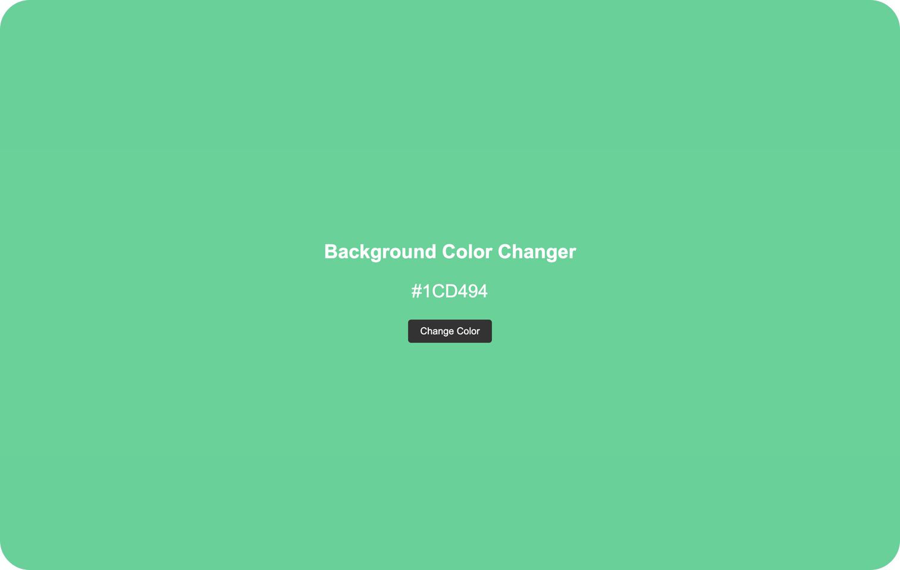

# Background Color Changer

## Description
Background Color Changer is a JavaScript project that allows users to dynamically change the background color of a webpage by clicking a button. The project provides a simple and intuitive interface where users can experience the fun of random color generation.

The main functionality of Background Color Changer is based on JavaScript. Upon clicking the button, the application generates a random color code and applies it as the background color of the webpage. Additionally, the generated color code is displayed as text, allowing users to easily identify the current background color.

This project is designed to showcase the capabilities of JavaScript in manipulating the DOM and dynamically updating webpage elements. It serves as a fun and interactive way to explore the possibilities of color customization on a website.

## Demo

You can see a live demo of this project [here](https://codenaud.github.io/backgroundColorChanger/).

## Features
- Random generation of background colors
- Instantaneous update of the background color upon button click
- Display of the generated color code as text for reference

## Usage
1. Open the webpage in a web browser.
2. Click the "Change Color" button to generate a random background color.
3. Observe the updated background color and the corresponding color code displayed as text.

## Technologies Used
- HTML
- CSS
- JavaScript

## Future Enhancements
- Add a color palette to choose from predefined colors
- Implement additional color customization options, such as opacity or gradient effects
- Allow users to save their favorite color combinations

## Acknowledgments
The development of Background Color Changer was inspired by the desire to explore the dynamic nature of JavaScript and its ability to manipulate webpage elements. Special thanks to the online developer community for their invaluable resources and tutorials that helped in the creation of this project.

## License
This project is licensed under the [MIT License](https://opensource.org/licenses/MIT).

## Badges/Shields

Dev Skills

Design Skills

Build with

## About Me

I'm a junior frontend developer passionate about HTML, CSS and JavaScript, who wants to share the work of all the people who have helped me on the way to being able to dedicate myself to what I like the most.

## Contact

If you have any questions or suggestions, do not hesitate to contact me through my email: [codenaud@gmail.com](mailto:codenaud@gmail.com)

